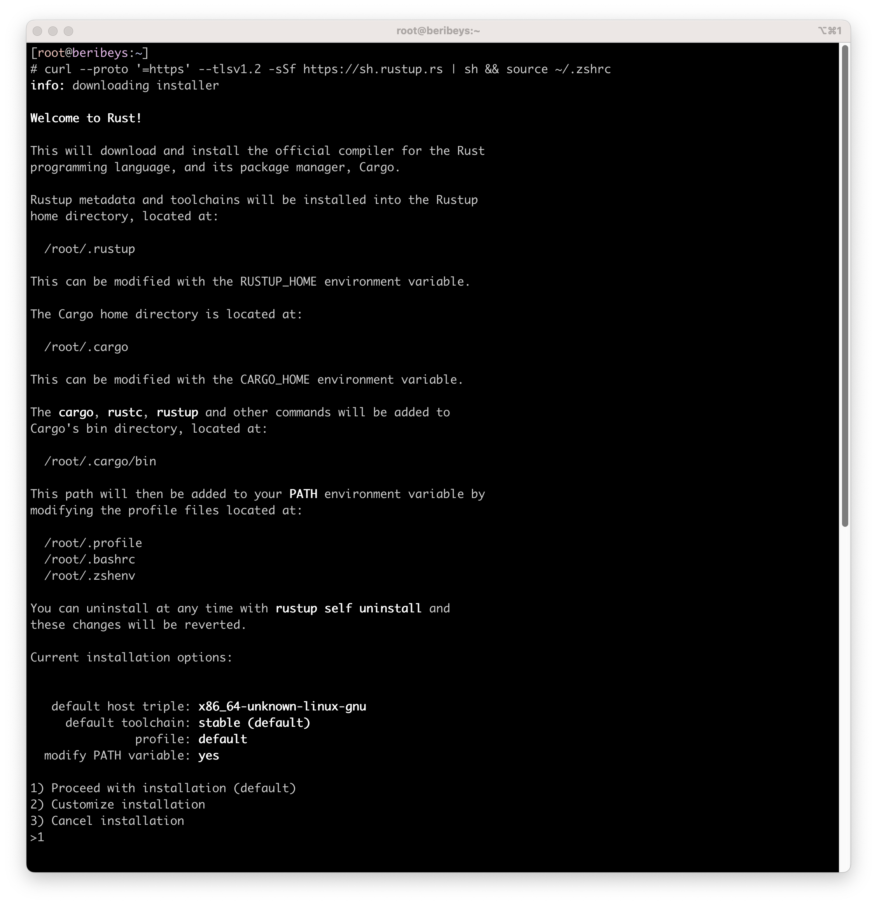
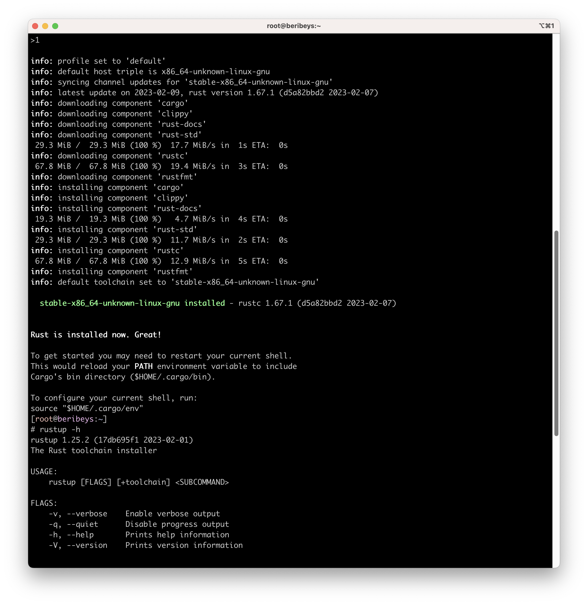
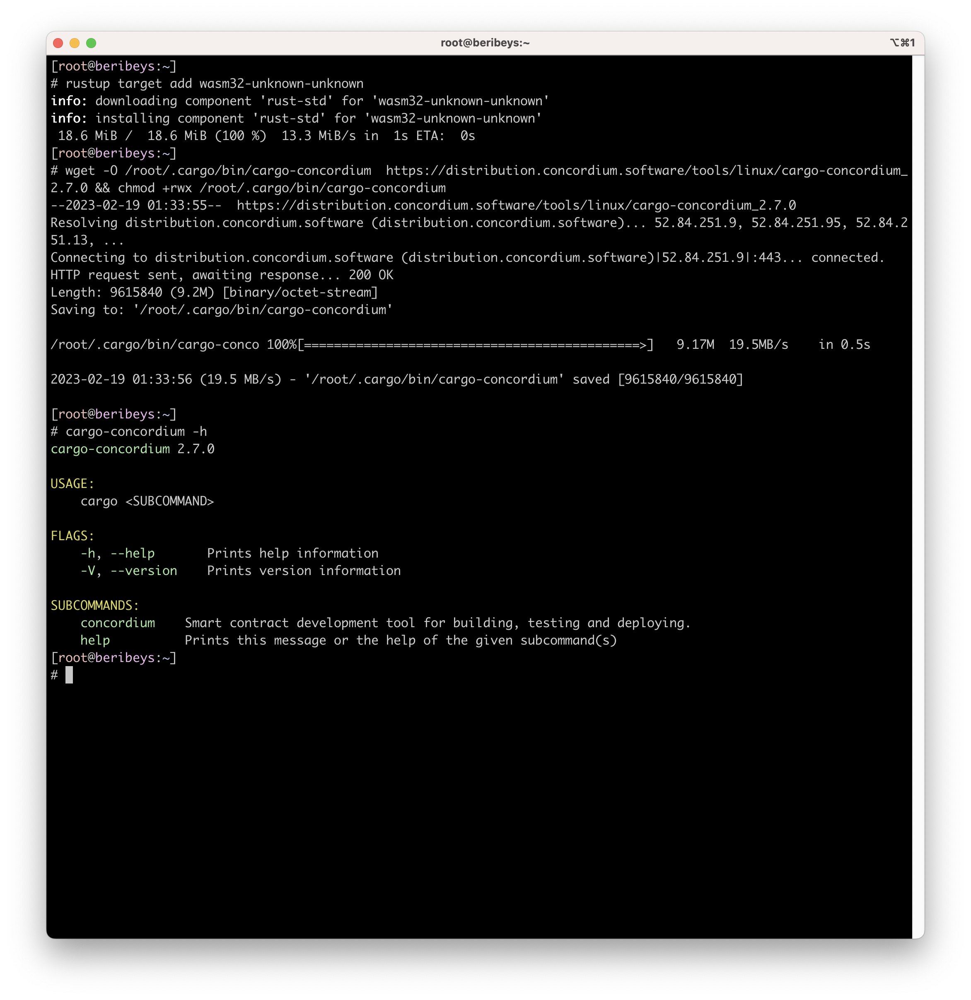
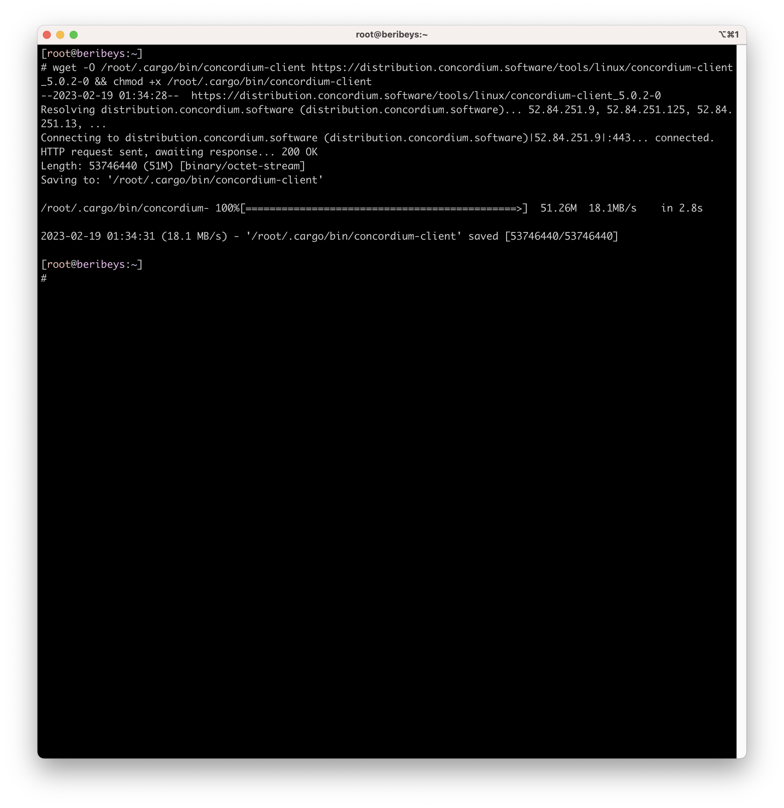
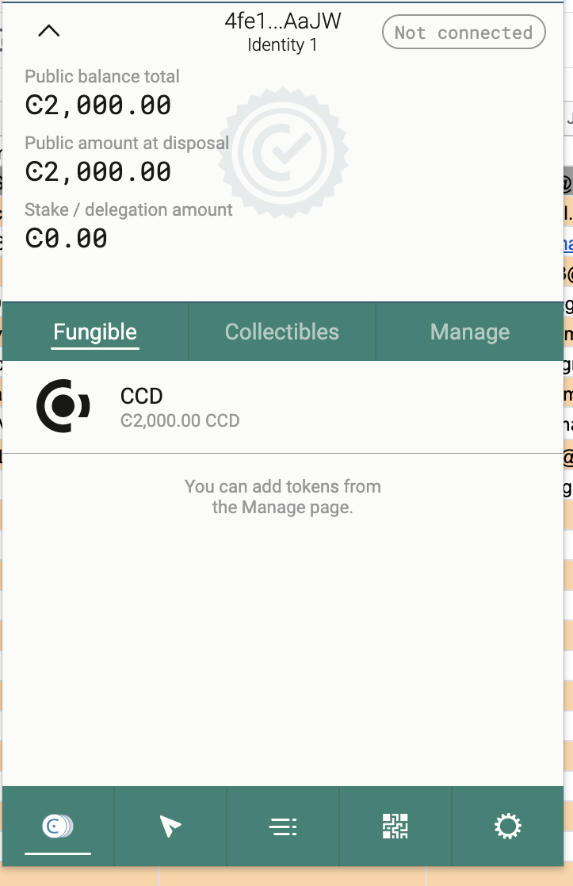
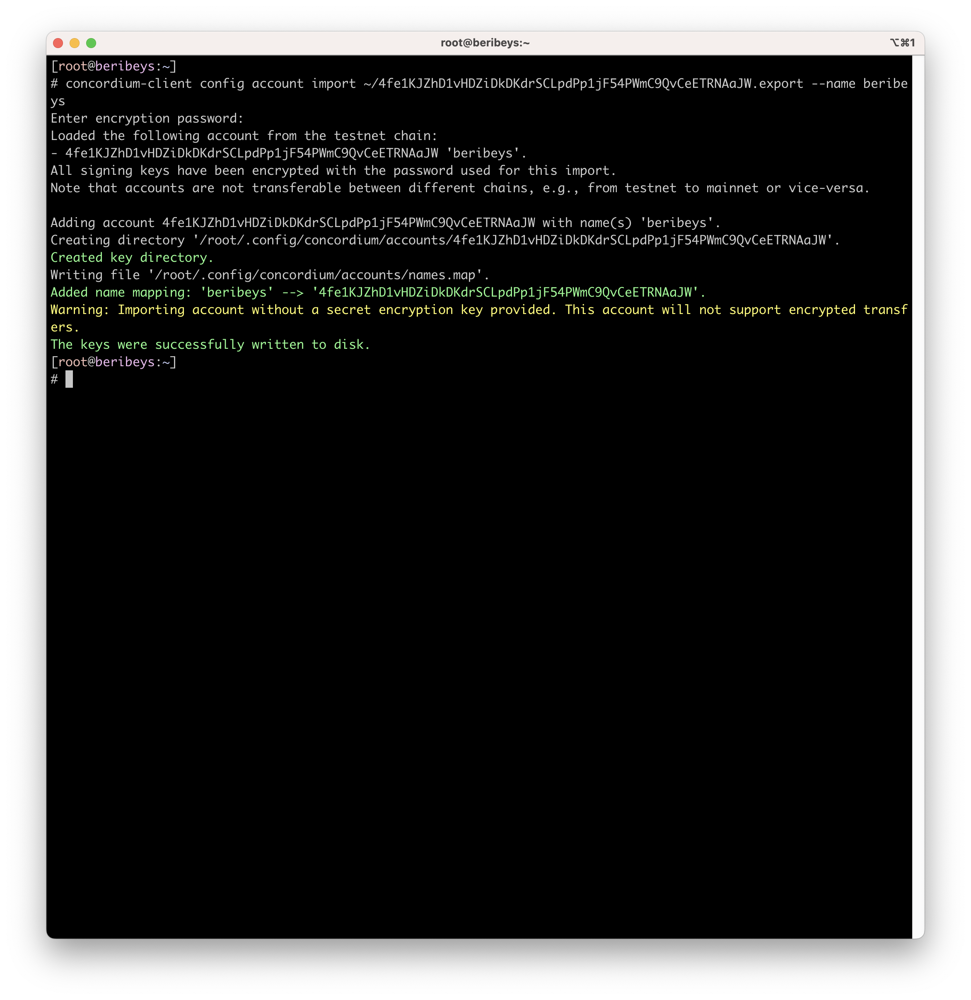

# Concordium Hackathon Task 1
This is a guide for developers to setup their environment for working with Concordium blockchain. Here are the steps:

## Install Rust: 
Follow the instructions on the Rust website.

## Install cargo-concordium: 
Use the command-line tool for compiling smart contracts and deploying them to the Concordium network.

## Install Concordium-client: 
Use the graphical user interface for managing accounts, transactions, and smart contracts.

## Create a Testnet account: 
Follow the instructions on the Concordium website and acquire testnet CCD from the CCD faucet.

## Export the account from the web wallet and import it into Concordium client: 
Follow the instructions on the Concordium website.

## Mainnet wallet
47AxZkxDS58BDHAmk7WUxhCxUFCf7turYSs4aVWkzSdKYjVLHa
